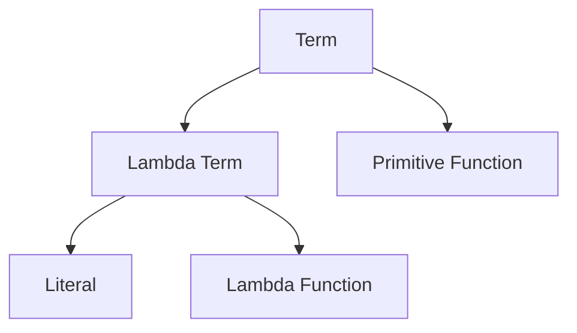

> [!WARNING]
> This article uses [[Unofficial Terminology]].

Each [[term]] in Google Sheets has a [type](https://en.wikipedia.org/wiki/Type_system) that determines which operations can be performed on it. For instance, you can only [[SUM]] [[Number|numbers]].

*Figure 1*. A diagram of high-level types.