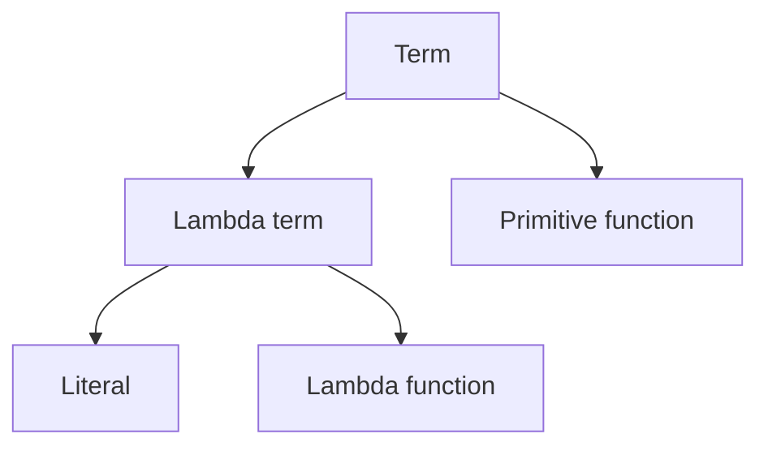

> [!WARNING]
> This article uses [[Unofficial terminology]].

Each [[Term]] in Google Sheets has a [type](https://en.wikipedia.org/wiki/Type_system) that determines which operations can be performed on it.

